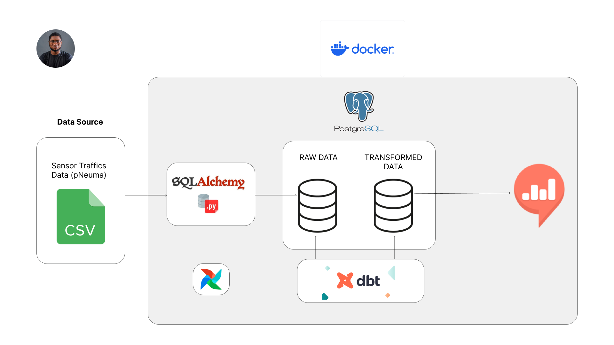

<!-- ABOUT THE PROJECT -->
## About The Project

Using a docker-compose file, developed a completely dockerized ELT pipeline with MySQL for data storage, Airflow for automation and orchestration, DBT for data transformation, and a Redash dashboard connected to the MySQL database.